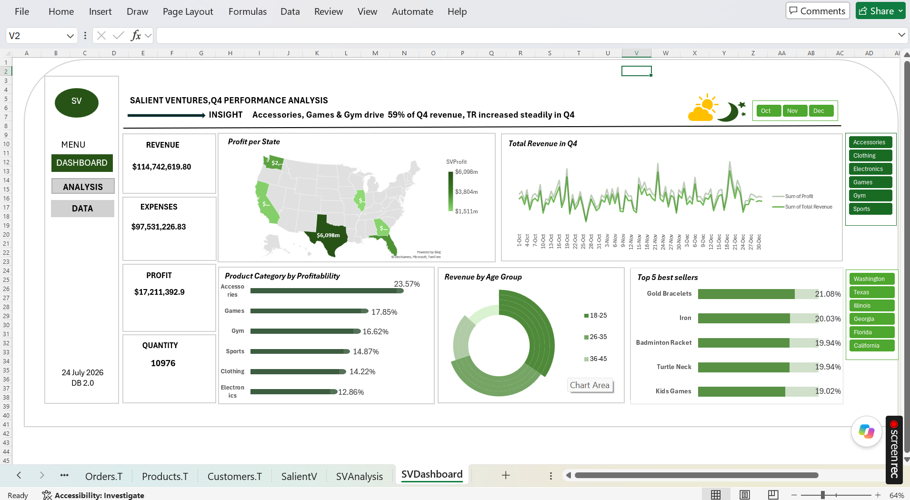
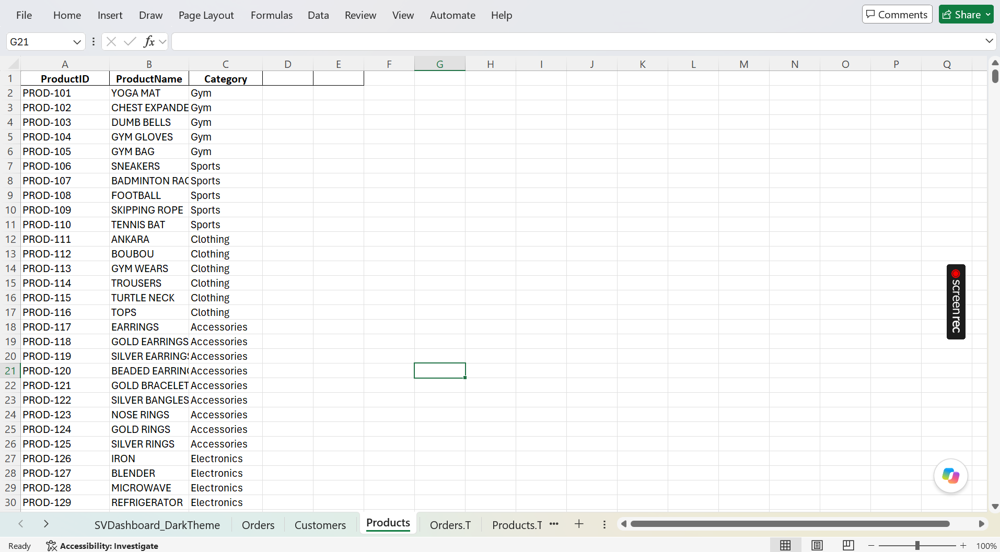
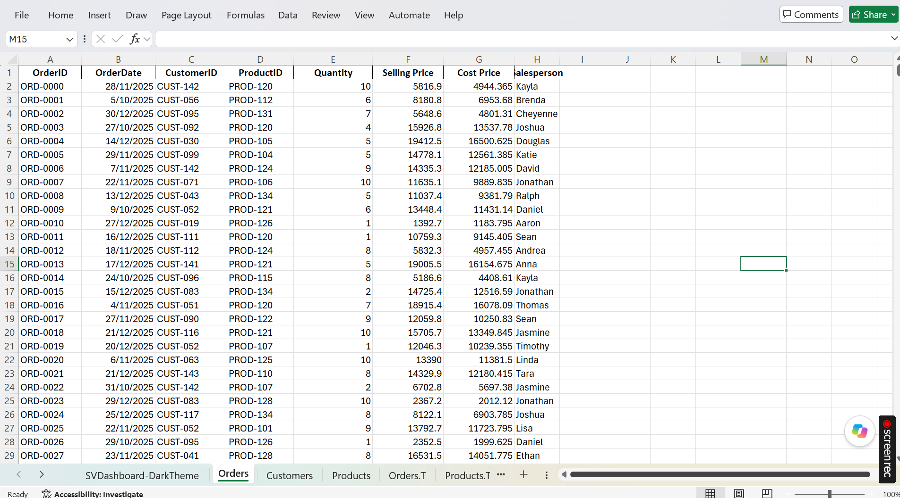
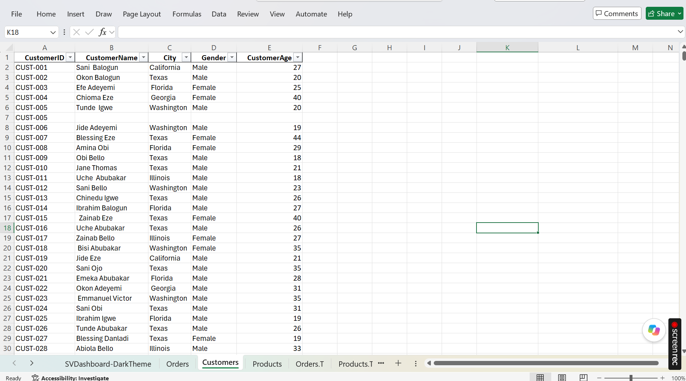
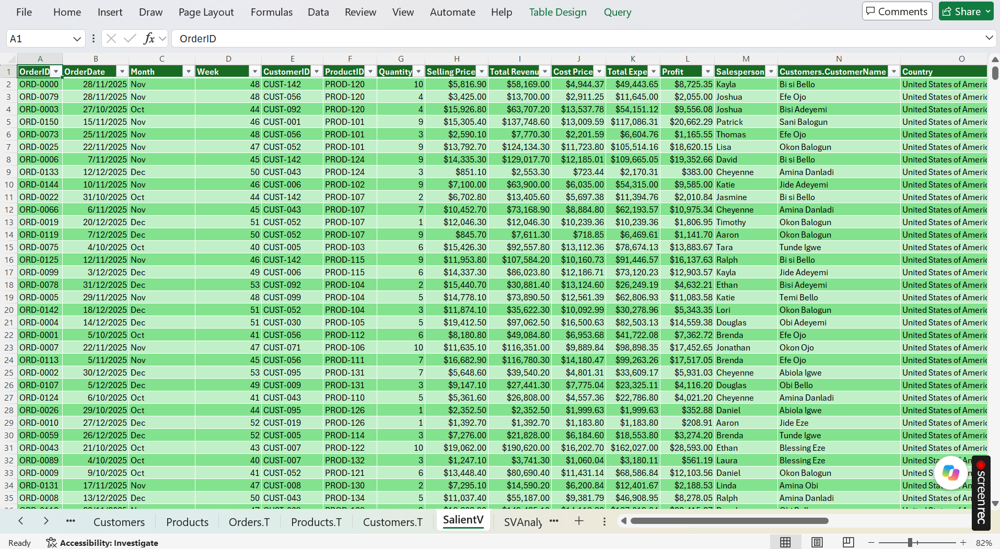
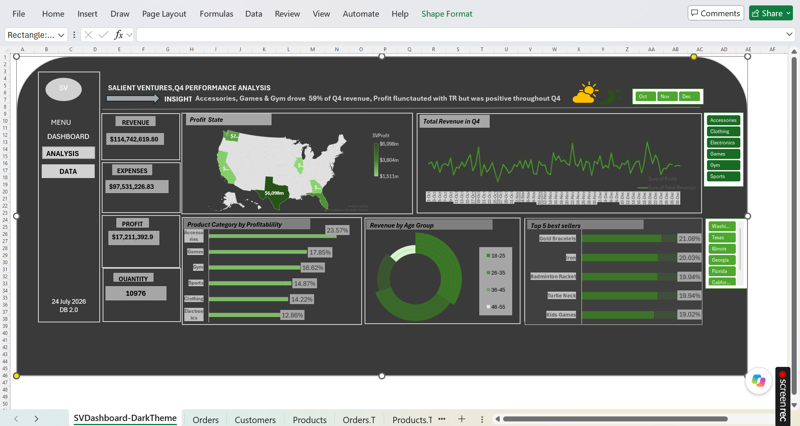

# Salient-Ventures-Q4-Sales-Performance-Analysis
This project transforms raw business data in the customers, products and orders tables to summarize key metrics and answer business questions to inspire business intelligence

</> Markdown

## Dashboard Preview
The dashboard summarized the dataset into a visually appealing, simple to understand view that supports real time, data driven decisions. 

## Products
This is the raw unprocessed products data

## Orders
This is the raw Orders dataset 

## Customers
This is the raw Customers dataset

### Data Preprocessing
#### Removed duplicate records
#### Filtered missing records
#### Combined dataset from different tables into a single table using Power Query
#### Segregated Customer age into segments using conditional ifs function.
#### Computed calculated fields

## Transformed Data
The merged dataset was transformed for performance analysis

## Dashboard-Dark theme
The dark themed dashboard summarized the key metrics. Visualization was set using moon icon for the dark theme mode

## Dashboard features
### Revenue, Expenses, Profit, and Quantity KPIs
### State, Month, and Product Category slicers
### Profit by State
### Total Revenue in Q4
### Top 5 best sellers
### Product category by profitablity
### Revenue by age group

